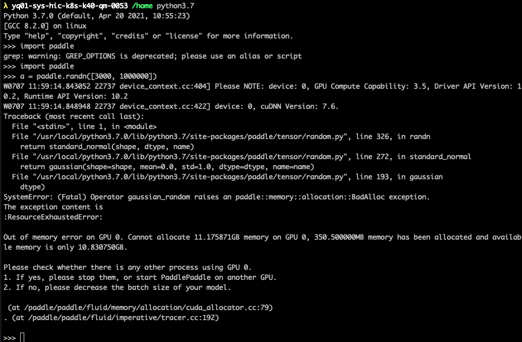
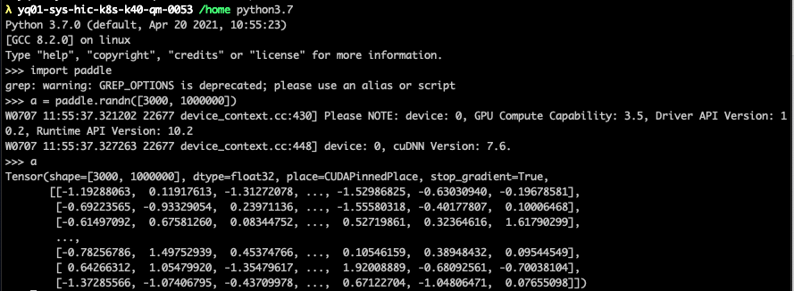
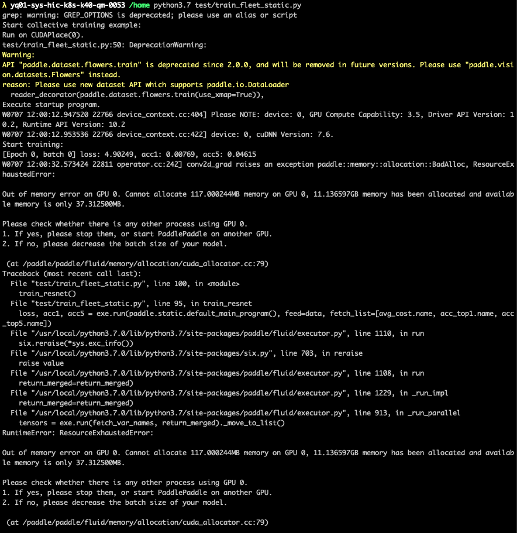
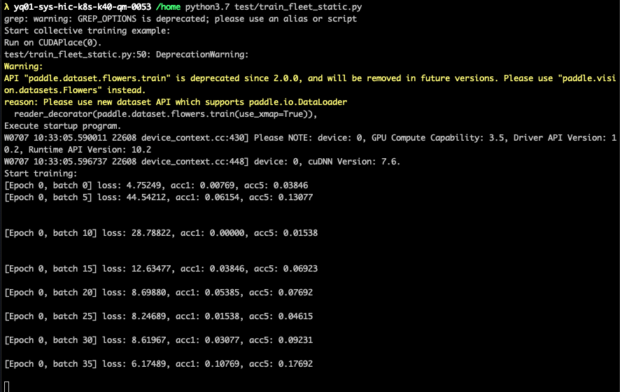

# Paddle GPU VMemory

## Background

When a large model is being trained, any unexpected memory related issues will cause the training job failed. This would take developers tons of time retraining and waste servers' computation. To solve this issue, a GPU vmem solution is launched. It trys to make GPU pinned memory as a backup. When GPU memory is insufficient for tensor allocation in a single mini-batch, the tensor can be allocated on GPU pinned memory which can prevent the job failed.

## Code analysis

```paddle/fluid/framework/tensor.cc``` is modified.

The modified code is as follows:

``` cpp
/* some versions of boost::variant don't have operator!= */
if (holder_ == nullptr || !(holder_->place() == place) ||
    holder_->size() < size + offset_) {
// Reset holder first before re-allocate to save memory
holder_.reset();
if (is_gpu_place(place)) {
    size_t available_memory = platform::GpuAvailableMemToAlloc();
    VLOG(1) << "The running device is GPU with available memory " << available_memory;
    if (size < size_t (available_memory * 0.6)) {
    VLOG(1) << "GPU memory is trying allocation with size " << size;
    holder_ = memory::AllocShared(place, size);
    } else {
    VLOG(1) << "GPU allocation failed, GPU pinned allocation is being used";
    auto modified_place = platform::CUDAPinnedPlace();
    holder_ = memory::AllocShared(modified_place, size);
    }
} else {
    holder_ = memory::AllocShared(place, size);
}
offset_ = 0;
}
```

When the tensor is being allocated, we first determine if it is allocated on GPU. If yes, we get the available memory that we can use on the GPU. If the size of tensor is larger than 0.6*available_memory, it will be allocated to the GPU pinned memory.

## Experiments

### Large tensor allocation

#### Official PaddlePaddle-gpu 2.1



#### Modified PaddlePaddle-gpu 2.1



### Resnet

#### Official PaddlePaddle-gpu 2.1



#### Modified PaddlePaddle-gpu 2.1


